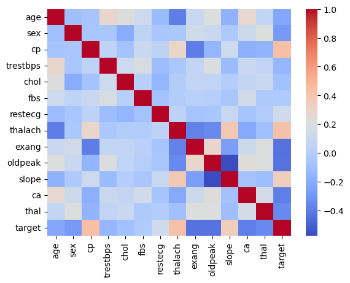
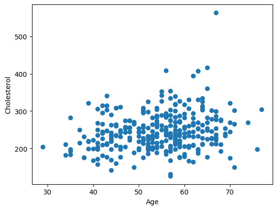
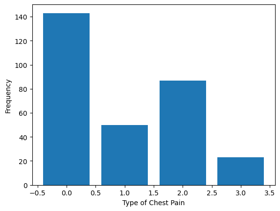
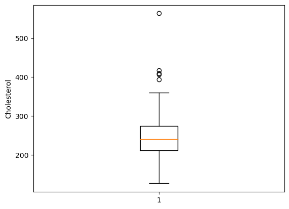
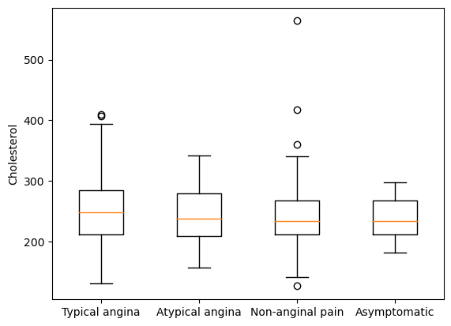
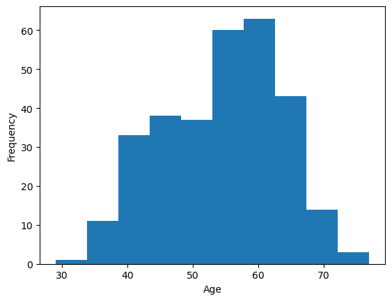
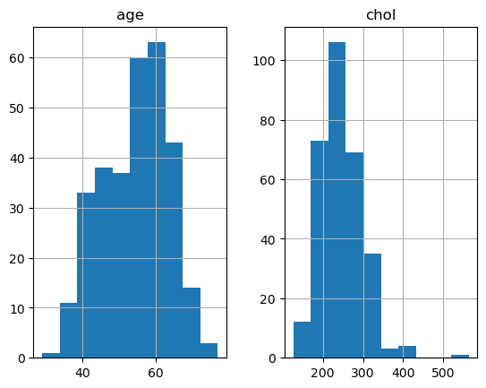

# Heart Disease Project
In this project, we import a data from a CSV file and perform simple calculations.


```python
# Importing libraries
import pandas as pd
import seaborn as sns
import matplotlib.pyplot as plt

# Loading csv file into a dataframe
data = pd.read_csv("./data/heart-disease.csv")
```

## Data exploration and cleaning
The data we loaded is a dataset containing information about patients heart history. Each row in the dataset represents one patient and each column represents a different variable. Here is a brief description of each column:

- age: The age of the patient in years.
- sex: The sex of the patient (0 = female, 1 = male).
- cp: The type of chest pain experienced by the patient (0 = typical angina, 1 = atypical angina, 2 = non-anginal pain, 3 = asymptomatic).
- trestbps: The resting blood pressure of the patient in mm Hg.
- chol: The serum cholesterol level of the patient in mg/dL.
- fbs: The fasting blood sugar level of the patient (0 = <120 mg/dL, 1 = >=120 mg/dL).
- restecg: The resting electrocardiographic results of the patient (0 = normal, 1 = having ST-T wave abnormality, 2 = showing probable or definite left ventricular hypertrophy).
- thalach: The maximum heart rate achieved by the patient during exercise.
- exang: Whether or not the patient has exercise-induced angina (0 = no, 1 = yes).
- oldpeak: ST depression induced by exercise relative to rest.
- slope: The slope of the peak exercise ST segment (0 = upsloping, 1 = flat, 2 = downsloping).
- ca: The number of major vessels (0-3) colored by fluoroscopy.
- thal: A blood disorder called thalassemia (0 = normal, 1 = fixed defect, 2 = reversible defect).
- target: Whether or not the patient has heart disease (0 = no, 1 = yes).


```python
# Random data from the csv file to audit the quality.
print(data.sample(n=5))
```

         age  sex  cp  trestbps  chol  fbs  restecg  thalach  exang  oldpeak  \
    171   48    1   1       110   229    0        1      168      0      1.0   
    20    59    1   0       135   234    0        1      161      0      0.5   
    165   67    1   0       160   286    0        0      108      1      1.5   
    294   44    1   0       120   169    0        1      144      1      2.8   
    82    60    0   2       102   318    0        1      160      0      0.0   
    
         slope  ca  thal  target  
    171      0   0     3       0  
    20       1   0     3       1  
    165      1   3     2       0  
    294      0   0     1       0  
    82       2   1     2       1  


```python
# Printing the data type of each of our variables (columns)
print(data.dtypes)
```

    age           int64
    sex           int64
    cp            int64
    trestbps      int64
    chol          int64
    fbs           int64
    restecg       int64
    thalach       int64
    exang         int64
    oldpeak     float64
    slope         int64
    ca            int64
    thal          int64
    target        int64
    dtype: object


```python
# Check for missing values
print(data.isnull())
```

           age    sex     cp  trestbps   chol    fbs  restecg  thalach  exang  \
    0    False  False  False     False  False  False    False    False  False   
    1    False  False  False     False  False  False    False    False  False   
    2    False  False  False     False  False  False    False    False  False   
    3    False  False  False     False  False  False    False    False  False   
    4    False  False  False     False  False  False    False    False  False   
    ..     ...    ...    ...       ...    ...    ...      ...      ...    ...   
    298  False  False  False     False  False  False    False    False  False   
    299  False  False  False     False  False  False    False    False  False   
    300  False  False  False     False  False  False    False    False  False   
    301  False  False  False     False  False  False    False    False  False   
    302  False  False  False     False  False  False    False    False  False   
    
         oldpeak  slope     ca   thal  target  
    0      False  False  False  False   False  
    1      False  False  False  False   False  
    2      False  False  False  False   False  
    3      False  False  False  False   False  
    4      False  False  False  False   False  
    ..       ...    ...    ...    ...     ...  
    298    False  False  False  False   False  
    299    False  False  False  False   False  
    300    False  False  False  False   False  
    301    False  False  False  False   False  
    302    False  False  False  False   False  
    
    [303 rows x 14 columns]


```python
# Check for duplicates
print(data.duplicated())
```

    0      False
    1      False
    2      False
    3      False
    4      False
           ...  
    298    False
    299    False
    300    False
    301    False
    302    False
    Length: 303, dtype: bool


## Data analysis
The data looks pretty clean so far. Let's do some basic data analysis. 

### Summary Stats
Let's calculate mean, count, standard deviation, minimum value, 25th percentile, median, 75th percentile, and maximum value.


```python
# Calculate summary statistics for each column.
print(data.describe())
```

                  age         sex          cp    trestbps        chol         fbs  \
    count  303.000000  303.000000  303.000000  303.000000  303.000000  303.000000   
    mean    54.366337    0.683168    0.966997  131.623762  246.264026    0.148515   
    std      9.082101    0.466011    1.032052   17.538143   51.830751    0.356198   
    min     29.000000    0.000000    0.000000   94.000000  126.000000    0.000000   
    25%     47.500000    0.000000    0.000000  120.000000  211.000000    0.000000   
    50%     55.000000    1.000000    1.000000  130.000000  240.000000    0.000000   
    75%     61.000000    1.000000    2.000000  140.000000  274.500000    0.000000   
    max     77.000000    1.000000    3.000000  200.000000  564.000000    1.000000   
    
              restecg     thalach       exang     oldpeak       slope          ca  \
    count  303.000000  303.000000  303.000000  303.000000  303.000000  303.000000   
    mean     0.528053  149.646865    0.326733    1.039604    1.399340    0.729373   
    std      0.525860   22.905161    0.469794    1.161075    0.616226    1.022606   
    min      0.000000   71.000000    0.000000    0.000000    0.000000    0.000000   
    25%      0.000000  133.500000    0.000000    0.000000    1.000000    0.000000   
    50%      1.000000  153.000000    0.000000    0.800000    1.000000    0.000000   
    75%      1.000000  166.000000    1.000000    1.600000    2.000000    1.000000   
    max      2.000000  202.000000    1.000000    6.200000    2.000000    4.000000   
    
                 thal      target  
    count  303.000000  303.000000  
    mean     2.313531    0.544554  
    std      0.612277    0.498835  
    min      0.000000    0.000000  
    25%      2.000000    0.000000  
    50%      2.000000    1.000000  
    75%      3.000000    1.000000  
    max      3.000000    1.000000  


### Correlations
Let's calculate correlations between columns using the corr() method. This will calculate the pairwise correlations between all numeric columns in the DataFrame and create a correlation matrix. The output will be a square matrix where each cell represents the correlation between two columns. The diagonal cells will be 1, to represent the correlations between pairs of columns. The values in the correlation matrix range from -1 to 1, where -1 represents a perfectly negative correlation, 0 represents no correlation, and 1 represents a perfectly positive correlation.


```python
correlations = data.corr()
print(correlations)
```

                   age       sex        cp  trestbps      chol       fbs  \
    age       1.000000 -0.098447 -0.068653  0.279351  0.213678  0.121308   
    sex      -0.098447  1.000000 -0.049353 -0.056769 -0.197912  0.045032   
    cp       -0.068653 -0.049353  1.000000  0.047608 -0.076904  0.094444   
    trestbps  0.279351 -0.056769  0.047608  1.000000  0.123174  0.177531   
    chol      0.213678 -0.197912 -0.076904  0.123174  1.000000  0.013294   
    fbs       0.121308  0.045032  0.094444  0.177531  0.013294  1.000000   
    restecg  -0.116211 -0.058196  0.044421 -0.114103 -0.151040 -0.084189   
    thalach  -0.398522 -0.044020  0.295762 -0.046698 -0.009940 -0.008567   
    exang     0.096801  0.141664 -0.394280  0.067616  0.067023  0.025665   
    oldpeak   0.210013  0.096093 -0.149230  0.193216  0.053952  0.005747   
    slope    -0.168814 -0.030711  0.119717 -0.121475 -0.004038 -0.059894   
    ca        0.276326  0.118261 -0.181053  0.101389  0.070511  0.137979   
    thal      0.068001  0.210041 -0.161736  0.062210  0.098803 -0.032019   
    target   -0.225439 -0.280937  0.433798 -0.144931 -0.085239 -0.028046   
    
               restecg   thalach     exang   oldpeak     slope        ca  \
    age      -0.116211 -0.398522  0.096801  0.210013 -0.168814  0.276326   
    sex      -0.058196 -0.044020  0.141664  0.096093 -0.030711  0.118261   
    cp        0.044421  0.295762 -0.394280 -0.149230  0.119717 -0.181053   
    trestbps -0.114103 -0.046698  0.067616  0.193216 -0.121475  0.101389   
    chol     -0.151040 -0.009940  0.067023  0.053952 -0.004038  0.070511   
    fbs      -0.084189 -0.008567  0.025665  0.005747 -0.059894  0.137979   
    restecg   1.000000  0.044123 -0.070733 -0.058770  0.093045 -0.072042   
    thalach   0.044123  1.000000 -0.378812 -0.344187  0.386784 -0.213177   
    exang    -0.070733 -0.378812  1.000000  0.288223 -0.257748  0.115739   
    oldpeak  -0.058770 -0.344187  0.288223  1.000000 -0.577537  0.222682   
    slope     0.093045  0.386784 -0.257748 -0.577537  1.000000 -0.080155   
    ca       -0.072042 -0.213177  0.115739  0.222682 -0.080155  1.000000   
    thal     -0.011981 -0.096439  0.206754  0.210244 -0.104764  0.151832   
    target    0.137230  0.421741 -0.436757 -0.430696  0.345877 -0.391724   
    
                  thal    target  
    age       0.068001 -0.225439  
    sex       0.210041 -0.280937  
    cp       -0.161736  0.433798  
    trestbps  0.062210 -0.144931  
    chol      0.098803 -0.085239  
    fbs      -0.032019 -0.028046  
    restecg  -0.011981  0.137230  
    thalach  -0.096439  0.421741  
    exang     0.206754 -0.436757  
    oldpeak   0.210244 -0.430696  
    slope    -0.104764  0.345877  
    ca        0.151832 -0.391724  
    thal      1.000000 -0.344029  
    target   -0.344029  1.000000  


#### Correlation matrix heatmap
We can visualize the correlation matrix as a heatmap using the heatmap() function from the seaborn library. This shows the pairwise correlations between all numeric columns in the DataFrame. The cells with higher absolute correlation values will be darker in color.


```python
# Visualize the correlation matrix as a heatmap
sns.heatmap(correlations, cmap='coolwarm')
plt.show()
```


    

    


### Calculate summary statistics for each group
We will now group the data by one or more columns and calculate summary statistics for each group using the groupby() method. This will group the data by the sex column (which has values of 0 for female and 1 for male) and calculate summary statistics for each group using the describe() method of the DataFrame. The output will be a DataFrame that shows the summary statistics for each group.


```python
# Group the data by sex and calculate summary statistics for each group
grouped_data = data.groupby('sex').describe()

# Print the summary statistics for male patients
print(grouped_data.loc[1])

# Print the summary statistics for female patients
print(grouped_data.loc[0])
```

    age     count    207.000000
            mean      53.758454
            std        8.883803
            min       29.000000
            25%       47.000000
                        ...    
    target  min        0.000000
            25%        0.000000
            50%        0.000000
            75%        1.000000
            max        1.000000
    Name: 1, Length: 104, dtype: float64
    age     count    96.000000
            mean     55.677083
            std       9.409396
            min      34.000000
            25%      49.750000
                       ...    
    target  min       0.000000
            25%       0.750000
            50%       1.000000
            75%       1.000000
            max       1.000000
    Name: 0, Length: 104, dtype: float64


### Scatter plot
To visualize the relationship between two numeric variables (e.g., age and cholesterol), you can create a scatter plot using the scatter() function from the matplotlib library. This will create a scatter plot that shows the relationship between age and cholesterol.


```python
# Create a scatter plot of age vs. cholesterol
plt.scatter(data['age'], data['chol'])
plt.xlabel('Age')
plt.ylabel('Cholesterol')
plt.show()
```


    

    


### Bar chart
To visualize the distribution of a categorical variable (e.g., the type of chest pain), you can create a bar chart using the bar() function. This will create a bar chart that shows the frequency of each type of chest pain.


```python
# Create a bar chart of the frequency of each type of chest pain
cp_counts = data['cp'].value_counts()
plt.bar(cp_counts.index, cp_counts.values)
plt.xlabel('Type of Chest Pain')
plt.ylabel('Frequency')
plt.show()
```


    

    


### Box plot
A box plot is a way to visualize the distribution of a numeric variable. It shows the median, quartiles, and outliers of the variable. You can create a box plot using the boxplot() function. This will create a box plot that shows the distribution of cholesterol in the dataset. The box represents the interquartile range (IQR), which contains the middle 50% of the data. The line inside the box represents the median, and the whiskers represent the range of data excluding outliers. Outliers are represented by individual points outside the whiskers.


```python
# Create a box plot of the distribution of cholesterol
plt.boxplot(data['chol'])
plt.ylabel('Cholesterol')
plt.show()
```


    

    


We can also create box plots for multiple variables at once by grouping the data and using the boxplot() method of the grouped DataFrame. We use the get_group() method to extract the values of the chol column for each group of the cp column. We then pass a list of these values to the boxplot() method of the matplotlib AxesSubplot object created by plt.subplots(). Finally, we use set_xticklabels() to set the x-axis labels to the names of the different types of chest pain.


```python
# Group the data by type of chest pain and create a box plot of the distribution of cholesterol for each group
grouped_data = data.groupby('cp')['chol']
fig, ax = plt.subplots()
ax.boxplot([grouped_data.get_group(x) for x in grouped_data.groups.keys()])
ax.set_xticklabels(['Typical angina', 'Atypical angina', 'Non-anginal pain', 'Asymptomatic'])
ax.set_ylabel('Cholesterol')
plt.show()
```


    

    


### Histogram
A histogram is a way to visualize the distribution of a numeric variable by dividing it into bins and showing the frequency of values in each bin. We can create a histogram using the hist() method of a pandas Series object. This is a histogram that shows the distribution of ages in the dataset. The x-axis shows the age values, divided into bins, and the y-axis shows the frequency of values in each bin.


```python
# Create a histogram of the distribution of age
plt.hist(data['age'])
plt.xlabel('Age')
plt.ylabel('Frequency')
plt.show()
```


    

    


Let's create two histograms side by side that show the distribution of age and cholesterol in the dataset. The x-axis shows the variable values, divided into bins, and the y-axis shows the frequency of values in each bin.


```python
# Create histograms of the distribution of age and cholesterol
data[['age', 'chol']].hist()
plt.show()
```


    

    

